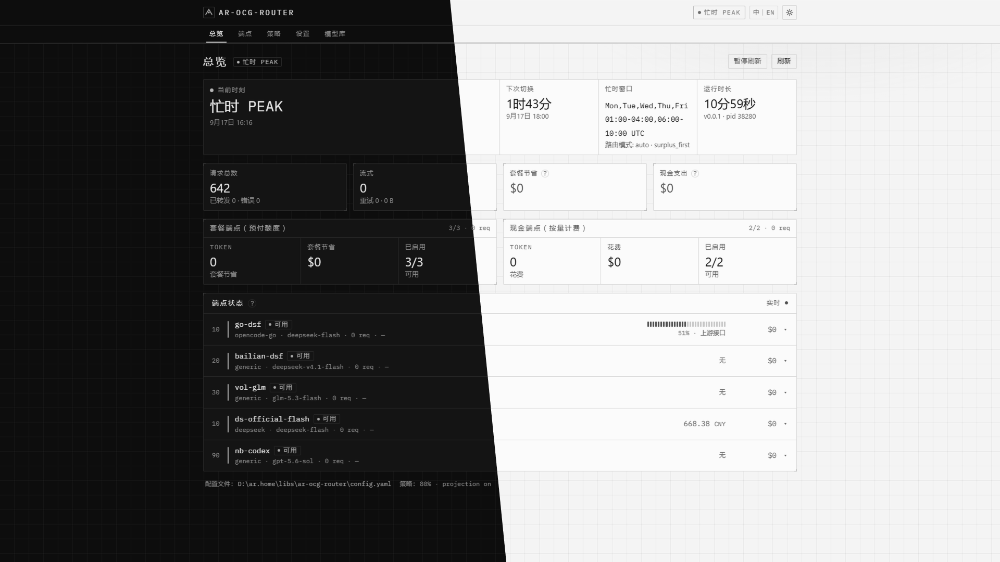
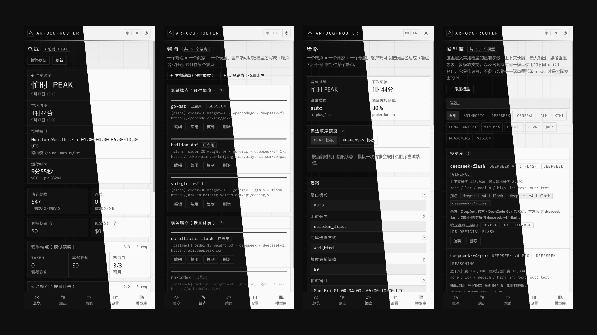

# ar-OCG-Router

[English](README.md) · [**中文**](README-zh.md)

把若干 LLM 订阅与按量付费的 API 账号，合成一个 OpenAI / Anthropic 兼容入口的单文件网关，
并按「忙时 / 闲时 + 额度余量」为每个请求挑选账号。

- **一个端点 = 一个商家 + 一个模型。** 每个端点只发出一个模型 id，原样透传，
  没有隐藏的模型映射需要排查。
- **感知忙闲时段。** DeepSeek 忙时官方 API 单价翻倍，因此优先使用预付额度；
  闲时则选择单价更低的一方。
- **自动失败切换。** 额度耗尽、429、401/403、5xx、网络错误、模型不存在，
  都会静默换到下一个账号，客户端无感。
- **内嵌 Web 控制台。** 整个界面编译进二进制，旁边不需要部署任何东西。
  见 [Web 控制台](docs/web-console-zh.md)。

## 界面截图

整个界面由二进制自己提供，地址是 `http://127.0.0.1:8787/`。每张图沿斜线拼接：
斜线左侧为浅色主题，右侧为深色主题。

**桌面端**——总览：



**手机端**——总览、端点、策略、模型库：



## 快速开始

```bash
# 1. 把二进制和配置放在同一目录
ar-ocg-router --check          # 校验配置后退出
ar-ocg-router --selftest       # 真实探测每个端点（密钥、/models、额度、一次请求）
ar-ocg-router                  # 启动服务

# 2. 客户端指向它
export OPENAI_BASE_URL=http://127.0.0.1:8787/v1
export OPENAI_API_KEY=anything
```

浏览器打开 <http://127.0.0.1:8787/> 即是 Web 控制台。

## 文档

| 文档 | 内容 |
| --- | --- |
| [配置参考](docs/configuration-zh.md) · [English](docs/configuration.md) | 全部字段：端点、路由策略、额度探测、兼容层 |
| [路由决策](docs/routing-zh.md) · [English](docs/routing.md) | 账号如何被选中、失败切换规则、会话亲和 |
| [Web 控制台](docs/web-console-zh.md) · [English](docs/web-console.md) | 内嵌界面、管理 API、改动如何落盘 |
| [模型库](docs/model-library-zh.md) · [English](docs/model-library.md) | 模型基准参数、别名、模型点选 |
| [HTTP 接口](docs/api-zh.md) · [English](docs/api.md) | 代理入口与管理接口 |
| [部署](docs/deployment-zh.md) · [English](docs/deployment.md) | 从源码构建、产物结构、系统服务 |
| [上游事实](docs/upstream-zh.md) · [English](docs/upstream.md) | 已实测的厂商结论、额度接口、合规 |
| [故障排查](docs/troubleshooting-zh.md) · [English](docs/troubleshooting.md) | 现象、原因、该改什么 |

## 为什么需要它

DeepSeek 官方与其转售方（OpenCode Go 及同类预付编程套餐）对同一批模型定价完全相同，
且忙时同样翻倍。因此预付额度的价值精确等于等量现金，真正能省钱的只有一件事：
**避免预付额度在窗口结束时未使用完毕**。这就是全部的路由策略：优先使用预付额度，
但当外推结果显示其将被用尽时，不再继续占用。

由此推出：客户端不该关心是哪个账号服务的。客户端把模型名写成 `ar-ocg-router`，网关自行决定。

## 状态

版本 0.0.1。[上游事实](docs/upstream-zh.md) 中的厂商行为基于 2026-09-17 的线上实测；
运行限制见 [故障排查](docs/troubleshooting-zh.md)。
