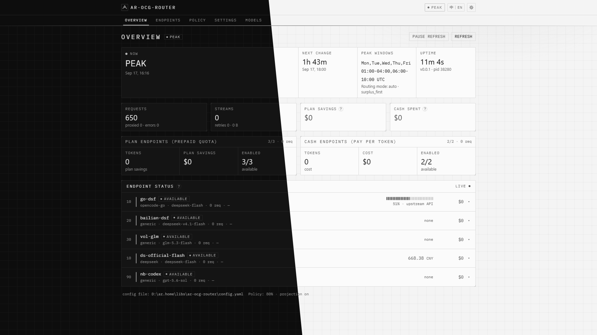
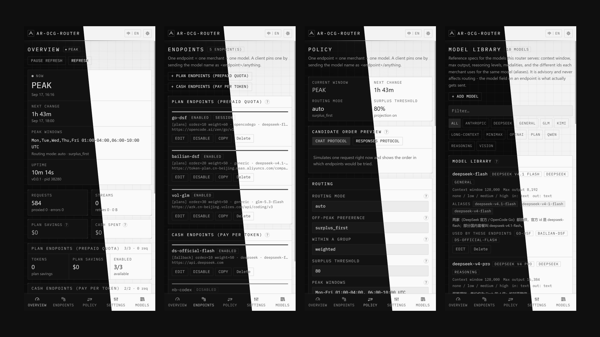

# ar-OCG-Router

[**English**](README.md) · [中文](README-zh.md)

A single-binary gateway that turns several LLM subscriptions and pay-as-you-go API
accounts into one OpenAI- and Anthropic-compatible endpoint, and picks the account for
each request from the peak/off-peak window and the remaining quota.

- **One endpoint = one merchant + one model.** Every configured endpoint sends exactly one
  model id, verbatim. There is no hidden model mapping to debug.
- **Peak/off-peak aware.** During DeepSeek's peak hours the official API costs double, so
  prepaid plans are drained first; off-peak, whichever is cheaper wins.
- **Automatic failover.** Quota exhaustion, 429, 401/403, 5xx, transport errors and
  "model not found" all move on to the next account without the client noticing.
- **Embedded web console.** The whole UI is compiled into the binary; there is nothing to
  install next to it. See [Web console](docs/web-console.md).

## Screenshot

The whole UI is served by the binary itself at `http://127.0.0.1:8787/`. Each image is split
diagonally: light theme on the left of the seam, dark theme on the right.

**Desktop** — Overview:



**Mobile** — Overview, Endpoints, Policy and Model Library:



## Quick start

```bash
# 1. put the binary and a config next to each other
ar-ocg-router --check          # validate the config and exit
ar-ocg-router --selftest       # probe every endpoint for real (keys, /models, quota, one request)
ar-ocg-router                  # serve

# 2. point a client at it
export OPENAI_BASE_URL=http://127.0.0.1:8787/v1
export OPENAI_API_KEY=anything
```

Then open <http://127.0.0.1:8787/> for the web console.

## Documentation

| Document | What it covers |
| --- | --- |
| [Configuration](docs/configuration.md) · [中文](docs/configuration-zh.md) | Every field: endpoints, router policy, quota probing, compatibility layer |
| [Routing](docs/routing.md) · [中文](docs/routing-zh.md) | How an account is chosen, failover rules, session affinity |
| [Web console](docs/web-console.md) · [中文](docs/web-console-zh.md) | The embedded UI, its API, and how edits reach disk |
| [Model library](docs/model-library.md) · [中文](docs/model-library-zh.md) | Reference specs for models, aliases, the model picker |
| [HTTP API](docs/api.md) · [中文](docs/api-zh.md) | Proxy entry points and the admin API |
| [Deployment](docs/deployment.md) · [中文](docs/deployment-zh.md) | Build from source, package layout, system services |
| [Upstream notes](docs/upstream.md) · [中文](docs/upstream-zh.md) | Verified provider facts, quota endpoints, compliance |
| [Troubleshooting](docs/troubleshooting.md) · [中文](docs/troubleshooting-zh.md) | Symptoms, causes, and what to change |

## Why this exists

DeepSeek's API and its resellers (OpenCode Go and similar prepaid coding plans) price the
same models identically, and both double the price during peak hours. Prepaid quota is
therefore worth exactly its cash equivalent, so the only thing that actually saves money is
**not letting prepaid quota go unused**. That is the entire routing policy: spend prepaid
quota first, but stop hoarding it when the window shows it will expire unused.

The consequence is that clients should never care which account served a request. They send
`ar-ocg-router` as the model and the gateway decides.

## Status

Version 0.0.6. Provider behaviour in [Upstream notes](docs/upstream.md) reflects live API
verification on 2026-09-17; operational limits are in
[Troubleshooting](docs/troubleshooting.md).
